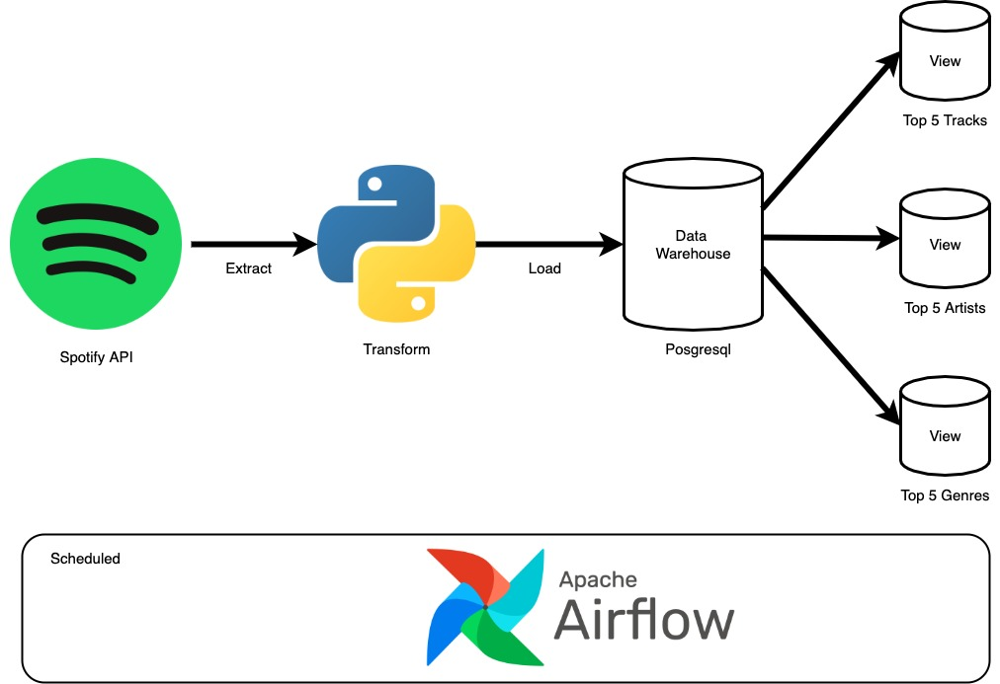

# SPOTIFY DATA PIPELINE
Simple data pipeline that download songs list we've listened in the last 24-hours from Spotify API, save into Postgresql as Data Warehouse, and create view top 5 tracks, artists, and genres. This pipeline is scheduled to run daily using Airflow. Generate Spotify API access token in https://developer.spotify.com/console/get-recently-played/

## Prerequisite
1. Python 3.8.x
2. Apache Airflow 2.2.3
3. Apache Spark 3.2.0

## ETL Diagram

